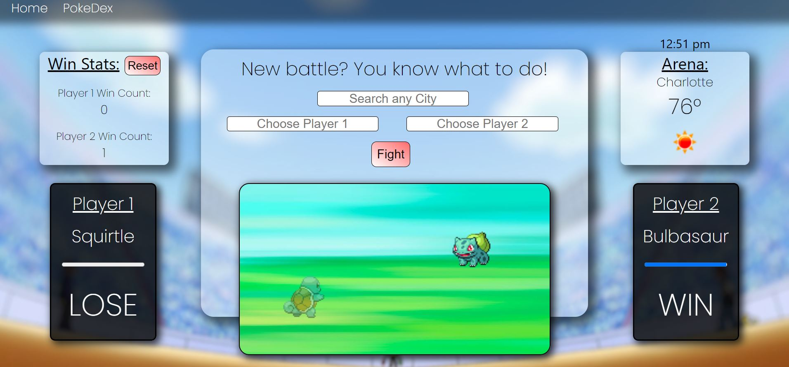

# PokeBattle Simulator
Pokemon Battle
## Table of Contents
- Description
- Usage
- Screenshot of Deployment
- Contact/Collaborators 
- License

- [Link to live deployed site](https://lilyws.github.io/pokemon-battle/index.html)
- [Link to github repo](https://github.com/LilyWS/pokemon-battle)

### Description
The user will be able to battle the selected Pokemon based off the current location of the user. The Pokemon powers and attacks will be influenced by the weather that is occuring in the users current area.
- Ex: if it is raining in Charlotte,NC, a Squirtle would be a great choice!

The battle continues without the users input, however the user will be able to see the health status of both Pokemon to stay interactive with the battle. 

### Usage
- "How to Play" button will be located at the top left of the page, this will take the user to an Instructions page.
- Using the PokeApi the user will be able to select their Pokemon
- Using the OpenWeather API the Pokemon's stats will be set, to determine a winner
    - The User will be able to select 2 pokemon to battle and have the application pick a winner based on conditions.
- Once provided with the outcome of the users battle, Local Storage will keep track of and display how many times each seclection has won/lost. 

### Screenshot

### Contact/Collaborators
Lily Sperber (lilywsperber@gmail.com)
Alex Wilson (alexwilson0017@yahoo.com)
Thurston Cox (thurstoncox3@gmail.com)
- API'S
    - PokeAPI
    - OpenWeather

### License
Distributed under the MIT License. See `LICENSE` for more information.
